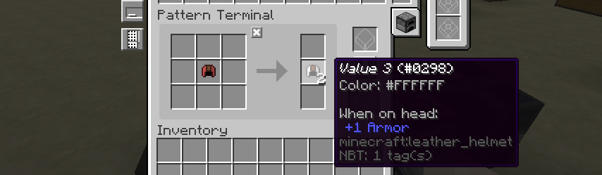
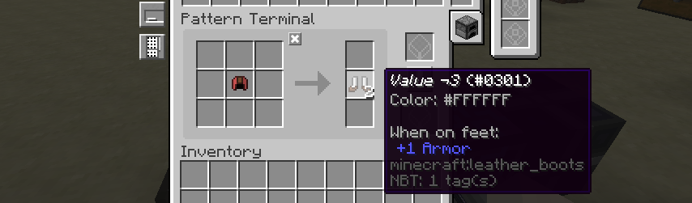
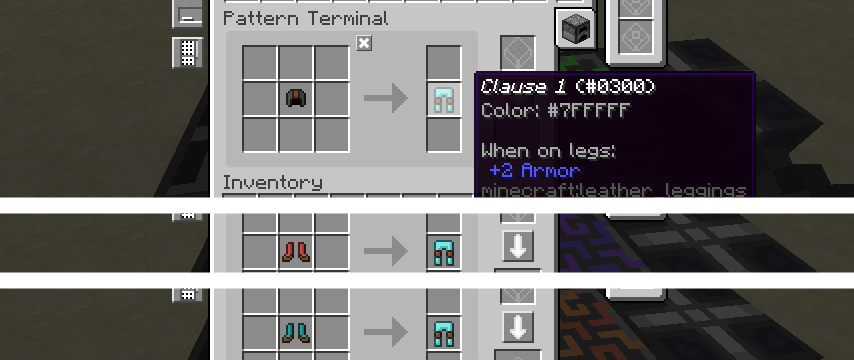
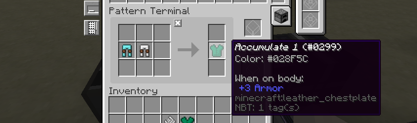
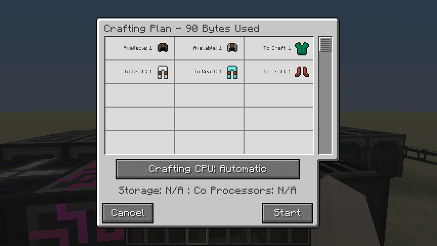
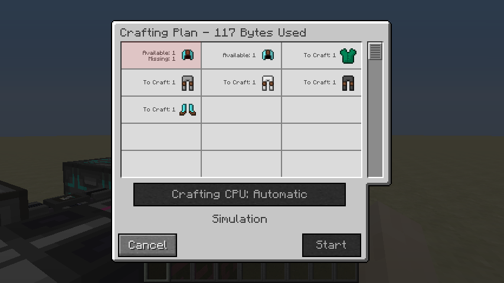

# Autocrafting is NP-hard

> **Disclaimer:** I am by no means an expert in this sort of thing so please do correct me if I get things entirely
> wrong! I should also warn you that, whilst I'll try to keep this as accessible as possible, some prior
> programming/comp-sci knowledge is recommended.

> **Note:** Previously I claimed that autocrafting was NP-complete. As /u/GandhiNotGhandi[^np] pointed out, we only
> prove that autocrafting is NP-hard.

In this little document we'll show that one can represent Boolean satisfiability problems as Applied Energistics (or
Refined Storage) crafting recipes, and so prove that autocrafting is NP-hard.

Firstly, let's start with some simplistic definitions:
 - NP: Whilst we could witter on about "Non-deterministic polynomial
   time" or whatever, for all intents and purposes this just means "it
   takes a long time".
 - Boolean satisfiability: a problem which attempts to determine whether there is a collection of variables that will
   result in a given Boolean expression evaluating to true.

## Encoding a Boolean expression
For simplicity's sake, we'll limit our Boolean expressions to *conjunctive normal form*. Whilst it is possible to
represent a less limited set of expressions, this approach makes things simpler without losing any expressive
power. Conjunctive normal form simply means our formulae is composed of several parts:

 - **Variables** ($$a$$, $$b$$, ...): These need little explanation. We will attempt to determine whether each variable
   will be true or false.
 - **Negations** ($$\neg a$$): One can only take negations of variables.
 - **Disjunctions** ($$a \vee \neg b$$): At least one child expression must evaluate to true. Note that every child must
   be a variable or a negation.
 - **Conjunction** ($$(a \vee b) \wedge (c \vee d)$$): All child expressions must evaluate to true. Note that every
   child must be a disjunction.

Now we've got these 4 simple constructs, we now need to find a way to represent them in the system...

###  Variables
We'll represent all terms in our system with some form of coloured leather armour. This provides us with a large number
of unique items which are both visually distinct but easilly classifiable. For variables, we'll use leather helmets. We
take *one* unique helmet for each variable and insert it into the AE (or RS system).

Whilst this is a good start, it is not quite enough to represent a variable. As variables may be used multiple times in
different conjunctions, we must create a recipe mapping our "variable item" to several "truthy item"s.[^vars] As a
variable should appear in each disjunction clause at most once, we only need to produce a stack with the same number of
items as clauses.

You may be wondering why we don't just start with these truthy items. It may seem strange, but this rather round-about
method comes in useful in the next step...

### Negation
If our negation of a variable must be true, then we know the original variable cannot be true. Or more simply, one
cannot use a variable and its negation in the same solution. This, like the truthy items, we create a recipe converting
our initial variable item to several "falsey item"s (or "negation item"s). As there is only one variable item in the
system, only one recipe can be used and so only truthy or falsey items can be used in the solution.

### Disjunction
For a disjunction to hold, only one of its constitute atoms must hold. Thus for each element in the disjunction we
create a recipe which converts our "atom item" (either a variable or negation item) into some unique item for this
disjunction. As we'll only need this "disjunction item" once, only one atom needs to be true.

### Conjunction
Conjunction are comparatively easy to represent: as all children must evaluate to true, we just create a recipe from all
constituents to some other unique item.

## Trying it out
Let's start with a pretty simple Boolean expression:

$$
(a \vee \neg b \vee a \neg c) \wedge (a \vee \neg b \vee c)
$$

This only has three variables and two clauses (or disjunctions) and so should be pretty trivial to solve. We'll use our
above rules to express the expression in a items and recipes. Even this trivial example requires 3 initial items and 10
patterns. None the less, we can still go ahead:

Fantastic! Looking at the result we can conclude that $$a$$ must be true (as it shows up in the recipe), $$b$$ must be
false and the value of $$c$$ is inconsequential. Thankfully this is a valid solution to our expression! There are other
solutions (any value of $$b$$ and $$c$$ are valid) but we only expected AE to return one.

Let's try something more complex. Maybe something with 4 variables and 3 clauses:

$$
(a \vee \neg b \vee \neg d) \wedge (\neg a \vee b \vee \neg c) \wedge (b \vee \neg c \vee d)
$$

Now this is an issue, it appears that AE says no solution exists when there clearly is one. Digging deeper, it's decided
$$b$$ should be true (which is fine) but also that $$a$$ should be true *and* false (which is less fine).

So whilst one *should* be able to solve SAT problems with your storage system, the current systems do not provide a
suitable algorithm for doing so: preferring something efficient but incomplete over something complete and
slow[^akarso].

## What now?
I'm going to be honest, the previous paragraph's conclusions leave me a little bit gutted. I really was looking forward
to factoring prime numbers through AE recipes. I think it's fair to say that the only logical conclusion is for us to
write our crafting system, with blackjack and DPLL.

On a more serious note, it is interesting that there are some circumstances where AE will say something is not craftable
when it is. Whether this is an issue in practice is a different matter, but I don't think I've ever concerned myself
with the practical side of things.

If you fancy experimenting yourself, I've put together [a Lua program][lua_cnf] which will spawn in the appropriate
items/patterns using ComputerCraft's command computer. You'll need to provide input in the form of [DIMACS `.cnf`
files][cnf_files]. I'd heartily recommend [this website](http://toughsat.appspot.com/) for generating files for random
files, but remember to keep the numbers small!

I'd like to finish off by thanking demhydraz, who got me going down this rabbit hole in the first place, and has been
immensely useful as a sounding board.

[lua_cnf]: https://gist.github.com/SquidDev/898a9674e412c851c31552e4ced615a6 "cnf.lua ComputerCraft script"
[cnf_files]: https://www.dwheeler.com/essays/minisat-user-guide.html "The .cnf format explained"
[reddit_np_hard]: https://www.reddit.com/r/feedthebeast/comments/7t8v0o/autocrafting_is_npcomplete/dtc105h/ "GhandiNotGhandi's commet about NP-hardness on Reddit"
[reddit_akarso]: https://www.reddit.com/r/feedthebeast/comments/7t8v0o/autocrafting_is_npcomplete/dtbgkz9/ "akarso's comments on Reddit"

[^np]: The full comment [can be read here][reddit_np_hard]. GhandiNotGhandi also makes some interesting comments on the
       what complexity class autocrafting could be in, if not NP.

[^vars]: The initial version of this missed out creating truthy items, meaning a variable could only ever be used once in
         the whole expression. Consequently satisfiable expressions may have been rejected. In the tests I ran it didn't
         have any effect on the result, but on a more complete crafting solver (with more complex expressions) it most
         definitely would.

[^akarso]: One of the AE2 developers has written some [very insightful comments][reddit_akarso] on both this post and
           autocrafting in general. It does a really good job of explaining some of the optimisations AE does in order
           produce crafting plans, as well as showing quite how complex autocrafting is.

