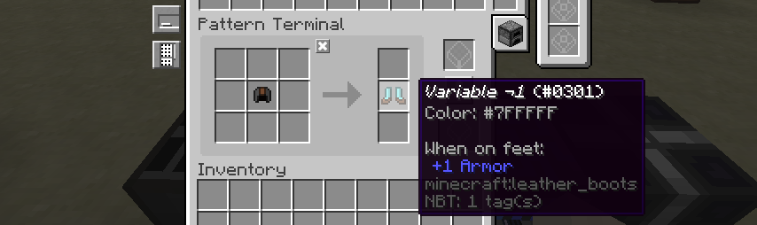
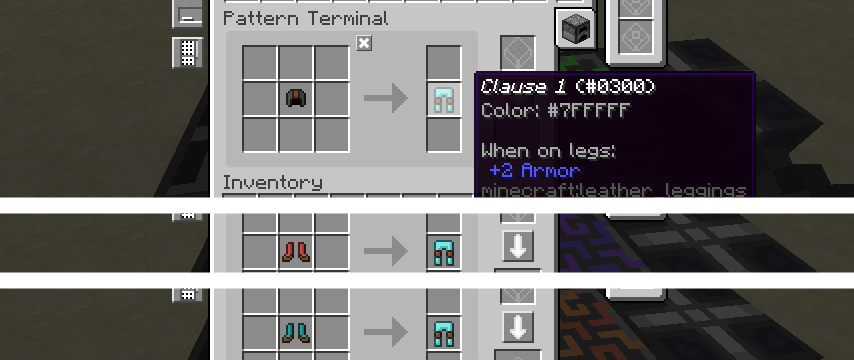
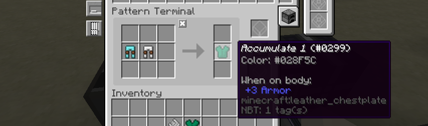
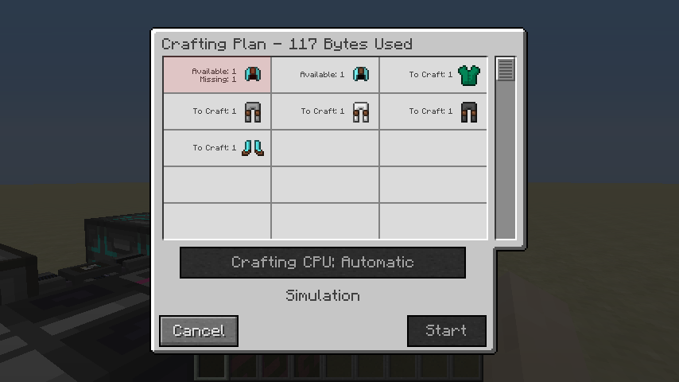

# Auto-crafting is NP-complete

> **Disclaimer** I am by no means an expert in this sort of thing so please do correct me if I get things entirely
> wrong! Secondly, whilst I'll try to keep this as accessible as possible, some prior programming/comp-sci knowledge is
> recommended.

In this little document we'll show that one can represent Boolean satisfiability problems as Applied Energistics (or
Refined Storage) crafting recipes, and so prove that autocrafting is NP-complete.

Firstly, let's start with some simplistic definitions:
 - NP-complete: Whilst we could witter on about "Non-deterministic polynomial time" or whatever, for all intents and
   purposes this just means "it takes a long time".
 - Boolean satisfiability: whether there is a collection of variables which will result in a Boolean expression
   evaluating to true.

## Encoding a Boolean expression
For simplicity's sake, we'll limit our Boolean expressions to *conjunctive normal form*. Whilst it is possible to
represent a less limited set of expressions, this approach makes things simpler without losing any expressive
power. Conjunctive normal form simply means our formulae is composed of several parts:

 - **Variables** ($$a$$, $$b$$, ...): These need little explanation. We will attempt to determine whether each variable
   will be true or false.
 - **Negations** ($$\neg a$$): One can only take negations of variables.
 - **Disjunctions** ($$a \vee \neg b$$): One (or more) child expression must evaluate to true. Note that every child
   must be a variable or a negation.
 - **Conjunction** ($$(a \vee b) \wedge (c \vee d)$$): All child expressions must evaluate to true. Note that every
   child must be a disjunction.

Now we've got this 4 simple constructs, we now need to find a way to represent them in the system:

###  Variables
Variables are definitely the simplest to represent. Simply chose some unique item and insert *one* into your AE (or RS)
system.

Note that all our variables are just differently coloured leather helmets. We'll use these (and other leather armour
pieces) as it allows for a large number of unique items.

### Negation
If our negation of a variable must be true, then we know the original variable cannot be true. Thus we define a crafting
recipe which converts our "variable item" into some unique "negation item". Only one of these can exist in the system at
one time (remember there is only one instance of each variable item).

### Disjunction
For a disjunction to hold, only one of its constitute atoms must hold. Thus for each element in the disjunction we
create a recipe which converts our "atom item" (either a variable or negation item) into some unique item for this
disjunction. As we'll only need this "disjunction item" once, only one atom needs to be true.

### Conjunction
Conjunction is definitely the easiest to represent: as all children must evaluate to true, we just create a recipe from
all constituents to some other unique item.

## Trying it out
Let's start with a pretty simple Boolean expression:
$$
(a \vee \neg b \vee a \neg c) \wedge (a \vee \neg b \vee c)
$$

This only has three variables and two clauses (or disjunctions) and so should be pretty trivial to solve. We'll use our
above rules to express the expression in a items and recipes. Even this trivial example requires 3 initial items and 10
patterns. None the less, we can try it:

Fantastic! Looking at the result we can conclude that $$a$$ must be true (as it shows up in the recipe), $$b$$ must be
false and the value of $$c$$ is inconsequential. Thankfully this is a valid solution to our expression! There are other
solutions (any value of $$b$$ and $$c$$ are valid) but we only expected AE to return one.

Let's try something more complex. Maybe something with 4 variables and 3 clauses:

$$
(a \vee \neg b \vee \neg d) \wedge (\neg a \vee b \vee \neg c) \wedge (b \vee \neg c \vee d)
$$

Now this is an issue, it appears that AE says no solution exists when there clearly is one. Digging deeper, it's decided
$$b$$ should be true (which is fine) but also that $$a$$ should be true *and* false (which is less fine).

So whilst one *should* be able to solve SAT problems with your storage system, the current systems do not provide a
suitable algorithm for doing so: preferring something efficient but incomplete over something complete and slow.

## What now?
I'm going to be honest, the previous paragraph's conclusions leave me a little bit gutted. I really was looking forward
to factoring prime numbers through AE recipes. I think it's fair to say that the only logical conclusion is for us to
write our crafting system, with blackjack and DPLL.

On a more serious note, it is interesting that there are some circumstances where AE will say something is not craftable
when it is. Whether this is an issue in practice is a different matter, but I don't think I've ever concerned myself
with the practical side of things.

